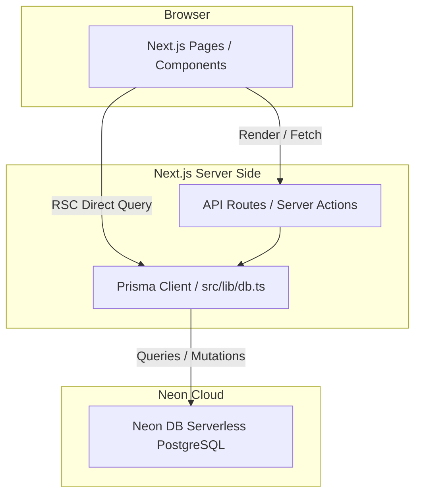

# Spec: Connecting Neon DB via Prisma ORM in Pulse Atelier

This specification outlines the architecture, database schema, data migration, and implementation details for integrating Neon DB into the Next.js website using Prisma ORM.

## 1. Goal & Context
Currently, the "Pulse Atelier" website uses local TypeScript files (in `src/data/*.ts`) for its catalog, products, orders, categories, and accounts. 
We want to transition the website to read and write dynamic data from/to a Neon DB (PostgreSQL) database. To achieve this in a type-safe and manageable way, we will use Prisma ORM.

---

## 2. Architecture & Components



### Components:
1. **Prisma Schema (`prisma/schema.prisma`)**: Defines the data models corresponding to the TS types in `src/types/domain.ts`.
2. **Prisma Client Client Utility (`src/lib/db.ts`)**: Reuses the Prisma connection instance to optimize connection pooling in dev/prod.
3. **Database Seeding (`prisma/seed.ts`)**: Imports the existing static TS mock data and seeds the Neon DB.
4. **Environment Config (`.env.local`)**: Contains the `DATABASE_URL` secret.

---

## 3. Database Schema definition

The models map directly to the `src/types/domain.ts` interfaces:

```prisma
datasource db {
  provider = "postgresql"
  url      = env("DATABASE_URL")
}

generator client {
  provider = "prisma-client-js"
}

model Brand {
  id        String    @id @default(uuid())
  name      String
  slug      String    @unique
  country   String
  summary   String
  products  Product[]
}

model Category {
  id          String    @id
  name        String
  slug        String    @unique
  description String
  products    Product[]
}

model Product {
  id                 String     @id @default(uuid())
  sku                String     @unique
  name               String
  slug               String     @unique
  brandId            String
  brand              Brand      @relation(fields: [brandId], references: [id])
  categoryId         String
  category           Category   @relation(fields: [categoryId], references: [id])
  price              Float
  originalPrice      Float?
  stock              Int
  lowStockThreshold  Int        @default(5)
  rating             Float      @default(0.0)
  reviewCount        Int        @default(0)
  soldCount          Int        @default(0)
  isFeatured         Boolean    @default(false)
  status             String     @default("active") // "active" | "draft"
  badges             String[]   // String array for badges
  image              String
  gallery            String[]   // String array for gallery images
  shortDescription   String
  description        String
  ecosystems         String[]   // String array for ecosystems
  useCases           String[]   // String array for useCases
  compatibilityNotes String[]
  batteryHours       Float      @default(0.0)
  connectivity       String[]
  waterResistance    String?
  sensors            String[]
  anc                Boolean?
  weightGrams        Float?
  warrantyMonths     Int        @default(12)
  bundleProductIds   String[]
  reviews            Review[]
}

model Customer {
  id                 String    @id @default(uuid())
  name               String
  email              String    @unique
  phone              String
  segment            String    @default("New") // "New" | "Loyal" | "VIP"
  address            String
  lifetimeSpend      Float     @default(0.0)
  wishlistProductIds String[]
  orders             Order[]
  reviews            Review[]
}

model Order {
  id              String      @id @default(uuid())
  orderNumber     String      @unique
  customerId      String
  customer        Customer    @relation(fields: [customerId], references: [id])
  status          String      @default("pending") // "pending" | "confirmed" | "packed" | "shipping" | "completed" | "cancelled"
  paymentStatus   String      @default("pending") // "pending" | "paid" | "failed"
  paymentMethod   String?     // "cod" | "bank" | "card"
  shippingAddress String
  note            String
  createdAt       DateTime    @default(now())
  subtotal        Float       @default(0.0)
  discount        Float       @default(0.0)
  shippingFee     Float       @default(0.0)
  total           Float       @default(0.0)
  items           OrderItem[]
}

model OrderItem {
  id        String   @id @default(uuid())
  orderId   String
  order     Order    @relation(fields: [orderId], references: [id], onDelete: Cascade)
  productId String
  quantity  Int
  unitPrice Float
}

model Review {
  id         String   @id @default(uuid())
  productId  String
  product    Product  @relation(fields: [productId], references: [id], onDelete: Cascade)
  customerId String
  customer   Customer @relation(fields: [customerId], references: [id])
  rating     Int
  content    String
  status     String   @default("pending") // "pending" | "published" | "hidden"
  createdAt  DateTime @default(now())
}
```

---

## 4. Seeding Process

A custom seed script `prisma/seed.ts` will:
1. Connect to Neon DB.
2. Clear existing records in cascade.
3. Batch insert `Category`, `Brand`, `Product`, `Customer`, `Order`, `OrderItem`, and `Review` parsed from `src/data/*.ts`.
4. Close Prisma connection safely.

We will add a seed command script runner in `package.json` to allow running:
```bash
npx prisma db seed
```

---

## 5. Verification Plan

### Automated Tests
- Validate Prisma schema structure with `npx prisma validate`.
- Verify database connection and schema push with `npx prisma db push` (or migration generation).
- Run seed script and confirm rows are generated in Neon DB.

### Manual Verification
- Test connection locally by querying Neon DB via a short test script in the scratchpad.
- Ensure the dev server builds and runs correctly post-integration.
