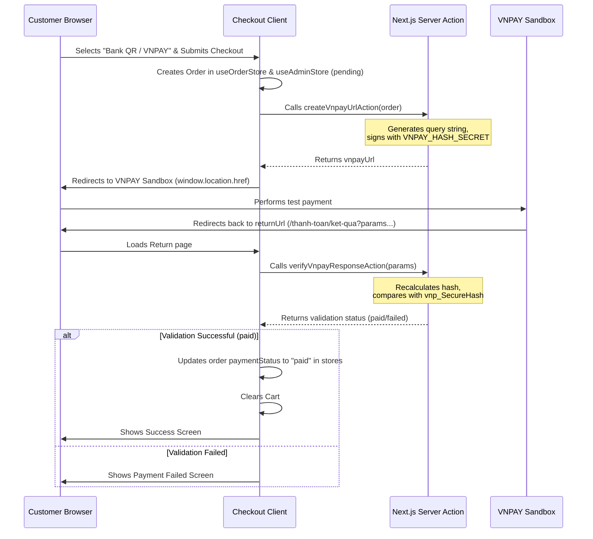

# Design Specification: VNPAY QR Payment Integration

**Date**: 2026-06-17  
**Status**: APPROVED  
**Topic**: VNPAY QR Payment Gateway Integration for Bank Payment Method  

---

## 1. Goal

Integrate VNPAY Sandbox (test environment) into the Pulse Atelier storefront application to enable secure, simulated banking QR payments. When the user selects "Bank QR / VNPAY" at checkout, they will be redirected to VNPAY's sandbox page. Upon completion, they will return to the storefront result page, which will verify the transaction and update their local order payment status.

---

## 2. Architecture & Data Flow



---

## 3. Configuration & Environment Variables

We will define the following environment variables in `.env` inside `apps/pulse-atelier`:

```env
VNPAY_TMN_CODE="TEMPUS"
VNPAY_HASH_SECRET="super-secret"
VNPAY_PAYMENT_URL="https://sandbox.vnpayment.vn/paymentv2/vpcpay.html"
VNPAY_RETURN_URL="http://localhost:3100/thanh-toan/ket-qua"
```

---

## 4. Proposed File Changes

### 4.1. Core Payment Helper
#### [NEW] [vnpay.ts](file:///c:/Users/mkb/.gemini/antigravity-ide/scratch/tempus-vn/apps/pulse-atelier/src/lib/vnpay.ts)
* Adapts the root `vnpay.ts` module. Contains helper functions to parse, sort, format, sign, and verify VNPAY HTTP parameters.
* Restricts execution to server-side only using `"server-only"`.

### 4.2. Server Actions
#### [NEW] [vnpay-actions.ts](file:///c:/Users/mkb/.gemini/antigravity-ide/scratch/tempus-vn/apps/pulse-atelier/src/lib/vnpay-actions.ts)
* `createVnpayUrlAction(orderNumber, amount, transactionRef)`: Returns signed sandbox URL.
* `verifyVnpayResponseAction(searchParamsString)`: Verifies signatures and returns status.

### 4.3. Interface Integrations
#### [MODIFY] [CheckoutForm.tsx](file:///c:/Users/mkb/.gemini/antigravity-ide/scratch/tempus-vn/apps/pulse-atelier/src/components/checkout/CheckoutForm.tsx)
* Renames "Chuyen khoan ngan hang" method label to "Thanh toan QR / VNPAY".
* Intercepts submissions with `"bank"` payment method, creates order, calls `createVnpayUrlAction`, and redirects the page to VNPAY.

#### [NEW] [page.tsx](file:///c:/Users/mkb/.gemini/antigravity-ide/scratch/tempus-vn/apps/pulse-atelier/src/app/thanh-toan/ket-qua/page.tsx)
* Payment result page. Calls `verifyVnpayResponseAction`, updates `useOrderStore` and `useAdminStore` order parameters, and renders UI according to payment success or failure.

---

## 5. Verification Plan

### Automated Verification
* Unit tests in `tests/vnpay.test.ts` to assert correct parameter signing and signature verification.
* Next.js build compilation.

### Manual Verification
* Perform a full check out selecting "Thanh toan QR / VNPAY".
* Process simulation on VNPAY sandbox, select test bank, and input sandbox test credentials.
* Redirect back to `/thanh-toan/ket-qua` and verify status marks as "paid".
